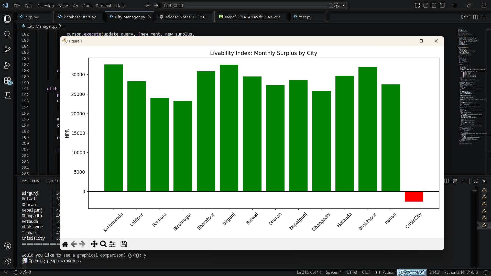

# 🇳🇵 Nepal City Manager & Economic Analyzer

A Python-based application designed to help users understand the financial reality of living in different cities across Nepal.

## 🚀 Key Features
* **Automated Tax Engine:** Calculates net income based on the 2026 Nepal Tax Slabs.
* **SQL Integration:** Uses SQLite for persistent storage of city economic data.
* **CRUD Functionality:** Create, Read, Update, and Delete city records via a CLI menu.
* **Data Visualization:** Generates bar charts comparing monthly surplus vs. deficit.

## 📊 Visual Insights


## 🛠️ Tech Stack
* **Language:** Python 3.14
* **Database:** SQLite3
* **Libraries:** Pandas, Matplotlib

## Core Logic
## 🧮 The Tax Engine
One of the core features is the `calculate_nepal_tax` function, which automates the progressive tax slabs for 2026:

* **Slab 1:** 1% for first 500k
* **Slab 2:** 10% for next 200k
* **Slab 3:** 20% for amounts above 700k

# snippet of the logic used
if annual_salary <= 500000:
    tax = annual_salary * 0.01
elif annual_salary <= 700000:
    tax = (500000 * 0.01) + (annual_salary - 500000) * 0.10

## How to Use
## 🕹️ User Interface
The application features a guided CLI menu:
1. View All Cities (Table View)
2. Search for a City (SQL LIKE Search)
3. Add New Economic Data
```python
